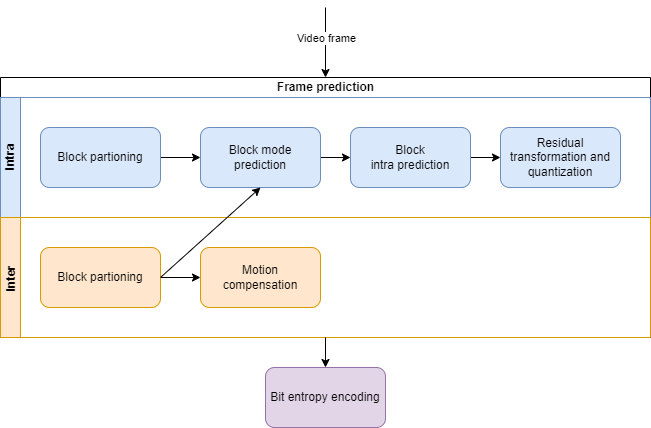

# Mobiclip codec

The Mobiclip video encoding was developed by
[Actimagine (now NERD)](https://en.wikipedia.org/wiki/Nintendo_European_Research_%26_Development)
for phones, PC and consoles (from GBA to Wii). This encoding has two variants
with the only difference in the motion compensation table and the color space
used.

The encoding is heavily based on H.264 and JPEG.

## Components

As with H.264 the main building blocks are:

- Frame prediction
  - Intra: pixels predicted from neighbor pixel blocks
  - Inter: frame predicted by moving pixel blocks from previous frames
- Residual transformation and quantization
- Bit entropy encoding

## Color space

The encoding uses the YUV color space with 4:2:0 down-sampling. Each key frame
(I slice) has information about the actual YUV color space that it provides. P
frames are derived from these, so they use the same color space. There are two
possible values:

- 0: YCoCg: used in the first versions of the codec (MODS containers).
- 1: YCbCr: used in following versions of the codec (Moflex containers).

## Frames

Just like H.264, each frame is divided in _macroblocks_ of 16x16 pixels for the
luma component and 8x8 pixels for the chroma U and V components. As it uses
4:2:0, it generates the same number of _macroblocks_ for each component.

Following the terminology of H.264, a frame contains only one _slide_, meaning
all the _macroblocks_ of the frame are encoded together at once.

## Prediction

There are two methods to encode a frame:

- _I frame_ / [Intra-frame prediction](#intra-frame-prediction): each
  _macroblock_ is encoded / predicted approximating the values of its neighbors.
  It does not require any other frame to get the output. This is also known as a
  _key frame_.
- _P frame_ / [Inter-frame prediction](#inter-frame-prediction): each
  _macroblock_ is predicted either using vectorized _motion compensation_ or
  _intra-frame prediction_.

### Intra-frame prediction

This encoding predicts the values of a block of pixels from its neighbors. The
difference between the prediction and the actual frame pixel is named
_residual_. This _residual_ along with the _prediction information_ (mode, has
residual info and partitioning) is what we encode in binary. More information
about the residual in [transformation](#transformation).

There are **nine** different prediction modes (0 to 8). They may happen on
blocks of 16x16, 8x8 or 4x4 size. Note that a block of 16x16 only supports mode
2 (delta plane) and its residual is anyway encoded in 8x8 or 4x4 blocks.

- 0: vertical
- 1: horizontal
- 2: delta plane
- 3: DC / average
- 4: horizontal up
- 5: horizontal down
- 6: vertical right
- 7: diagonal down right
- 8: vertical left

Except for _delta plane_, the implementation of the rest is identical to the
equivalent H.264 prediction mode. _Delta plane_ is similar to the _plane_
prediction mode but it can work with 4x4, 8x8 or 16x16 blocks and it reads an
integer as a _delta_.

The encoder saves additional bits by _predicting_ the mode value. If every
sub-block of 4x4 or 8x8 in a _macroblock_ uses the same prediction mode, this
mode is only encoded once at the beginning. Otherwise the value for each block
is also _"predicted"_ in the same way as H.264 (see
[encoding intra prediction modes](https://www.vcodex.com/h264avc-intra-precition/)).

For each block we encoded also a value indicating whether it has _residue_ data
or not (all predicted values matches final image). Instead of encoding a bit per
block, it encodes a variable-size integer used as an index in a pre-known table.

For 8x8 blocks, there is one value block at the _macroblock_ level with 6-bits:
4-bits for each luma 8x8 block and 2-bits for each chroma component. There is
another table for 4x4 blocks with 4-bits values (one for each block). These
tables contains all possible values (0-63 for 8x8 and 0-15 for 4x4) and are
sorted in a way where most-frequent values has a smaller index.

For each frame _macroblock_, first we have the information for its luma
component, then chroma U and finally chroma V. Then it follows for the next
frame _macroblock_.

### Inter-frame prediction

Inter prediction is based on copying blocks of component values (luma and
chroma) from previous decoded frames, up to 5 frames.

As with intra prediction, it works with macroblocks. For each of them the
encoders provide a value with the operation mode. The possible values are:

- 0: motion compensation with predicted vector
- 1-5: motion compensation with delta vector
- 6: intra prediction with mode per macroblock
- 7: intra prediction with mode per sub-block
- 8: partition current block by height
- 9: partition current block by width

Modes 6 and 7 uses the same intra-prediction macroblock decoding as a regular
intra-prediction frame. Modes 8 and 9 divide the current blocks by half in width
or height and reads a new operation mode value for each of them. This is a
recursive operation dividing blocks up to 2x4 or 4x2. All these operations
applies for the three components (luma and chromas) at the same time.

Motion compensation works by copying a block of the same size of the component
from a previous frame. The position in the previous frame may be different than
the current block position. The different is named motion vector and it's
encoded.

The algorithm predicts the vector value (X and Y deltas) by doing a median
between the last vector used in the **macroblock** to the left, to the right and
at the current position. For the first row some of these values may be zero, but
starting the second there should be a value for each of them. If a macroblock
was decoded with intra, then its vector is equal to zero (remember to update the
cache).

Mode 0 uses this predicted vector while for modes 1 to 5 there are two
exp-golomb integers indicating the delta X and Y values from the predicted
vector. The modes also indicate the index to the previous frame buffer. Mode 1
would take the last decoded frame, mode 2 the second to last and so on. Mode 0
will also use the last decoded frame.

The vector's X and Y values are encoded in double, meaning we should divide by 2
to get the actual position difference. This may point to a **_half-pixel_**
(half-pel) position. In that case the pixel is extrapolated from its neighbors.

## Transformation

The difference between the predicted values and its actual value is transformed
using the integer
[discrete cosine transform](https://en.wikipedia.org/wiki/Discrete_cosine_transform#DCT_visual_media_standards)
(DCT).

## Quantization

The coefficients from the transformation are then quantized. Each value is
divided by a constant, reducing the number of required bits to encode (saving
space) but also losing image quality.

There is a parameter for each frame that determines the quantization table to
use depending on the required target quality and space. More information
[here](https://www.vcodex.com/h264avc-4x4-transform-and-quantization/).

## Bit entropy encoding

The bit entropy encoding for the residual is based on the JPEG standard instead
of using CAVLC of H.264.

First it will create a list of integers from the coefficient matrix following a
zig-zag order. Then it will encode these integers with a mix of Huffman and
Run-Length encoding (RLE).

Starting at the beginning it encodes how many `0` integers there are until the
next non-zero value, and this value. This is encoded in a 12-bits integer. These
12-bits are encoded with Huffman with pre-known trees. Each frame contains an
index indicating what Huffman tree to use from two possibilities.

By setting the _amplitude_ to zero the encoder can indicate that it needs
further data to encode the _run_ or _amplitude_. A following bit set to `0`
indicates a bigger amplitude: it reads another block of 12-bits and adds to the
new amplitude a value from a table using the run as an index. If the flag was
`1`, then another bit indicates if the same operation is done for the _run_
instead. Otherwise, if these two bits are `1` and the _amplitude_ was zero, it
reads the information directly:

- end of block: 1 bit
- zeroes run: 6 bits
- amplitude: 12 bits

## Binary serialization

The compressed frame data, like a structure, needs to be encoded into bytes. In
this encoding, this is done at the bit level creating a _bit stream_ with
**little endianness**: first bit is the higher, at the left.

The format supports encoding the following types:

- Boolean: 1 bit. `0` for `false`, `1` for `true`.
- Fixed size integer
- Variable size integer:
  [Exponential Golomb coding](https://en.wikipedia.org/wiki/Exponential-Golomb_coding)
  and its signed integer variant.

_Exponential Golomb is identical to the
[Elias gamma code](https://en.wikipedia.org/wiki/Elias_gamma_coding) of x+1,
allowing it to encode 0. [source: wikipedia]_

Bits are written in blocks of 16-bits (in little endian). Meaning every time the
reader needs more data to decode a number of bits it will read 16-bits in little
endian order instead of a byte.

## NAL

The encoder does not encapsulate the data in any format or packets (like it
would be _NAL_ in H.264). It's pure _video codec layer_ (VCL). Frames are
encoded directly and passed to the muxer which mix them with audio samples (see
[MODS containers](./container-MODS.md)).
